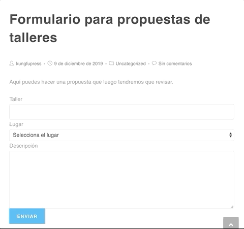

# KFP Form Taxon

Form Taxon es un plugin de ejemplo para aprender a utilizar taxonomías 
personalizadas en los campos tipo **select** de tus formularios de WordPress.

Tienes el tutorial completo en https://kungfupress.com/usar-taxonomias-desde-el-campo-select-de-un-formulario

En este tutorial se asocian las taxonomías personalizadas a un tipo de entrada 
personalizada (Custom Post Type) pero se podría hacer de manera similar con registros
que estuvieran en tablas de creación propia.

## Cómo utilizar el plugin

Para ver este plugin en acción descárgalo y actívalo en tu sitio WordPress, 
crea una página o entrada nueva e inserta en ella el shortcode [kfp_ftx_form_taller]

Al grabar y visualizar el nuevo contenido verás que aparece un formulario para 
crear un taller en el que puedes seleccionar un lugar de celebración del mismo. 

El listado de lugares se alimenta de una taxonomía personalizada que se ha creado 
desde el propio plugin y que podrás administrar desde el escritorio dentro del 
menú **Taller**

